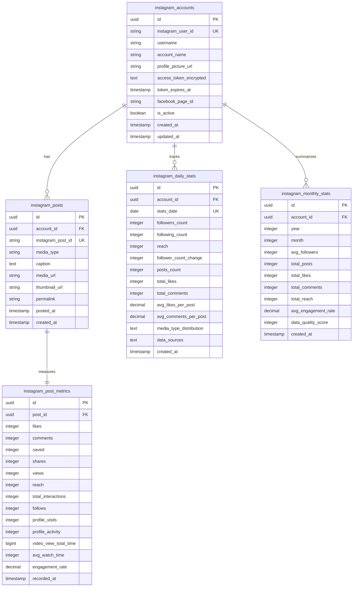

# Instagram Analysis Database Schema

**確定日**: 2025-06-25  
**バージョン**: 1.0  
**基準**: API検証結果に基づく取得可能データのみ  

---

## テーブル構成

### 1. instagram_accounts
Instagram アカウント情報

### 2. instagram_posts  
Instagram 投稿データ

### 3. instagram_post_metrics
投稿のパフォーマンスメトリクス

### 4. instagram_daily_stats
日別統計データ

### 5. instagram_monthly_stats
月別サマリーデータ

---

## ER図

---

## データ取得マッピング

| データ種別 | API エンドポイント | API フィールド | DB テーブル.フィールド |
|-----------|------------------|---------------|---------------------|
| **基本情報** | `/{ig-user-id}` | `followers_count` | `instagram_daily_stats.followers_count` |
| **基本情報** | `/{ig-user-id}` | `follows_count` | `instagram_daily_stats.following_count` |
| **Insights** | `/{ig-user-id}/insights` | `reach` | `instagram_daily_stats.reach` |
| **Insights** | `/{ig-user-id}/insights` | `follower_count` | `instagram_daily_stats.follower_count_change` |
| **投稿** | `/{ig-user-id}/media` | `like_count` | 集約 → `instagram_daily_stats.total_likes` |
| **投稿** | `/{ig-user-id}/media` | `comments_count` | 集約 → `instagram_daily_stats.total_comments` |
| **投稿メトリクス** | `/{ig-media-id}/insights` | `likes` | `instagram_post_metrics.likes` |
| **投稿メトリクス** | `/{ig-media-id}/insights` | `saved` | `instagram_post_metrics.saved` |

---

## API制限対応

- **1日3コール**: 基本フィールド(1) + Insights(1) + 投稿(1)
- **エラー耐性**: 基本フィールド優先、Insights失敗時は継続
- **レート制限**: 200コール/時間 → 66アカウント/日対応可能