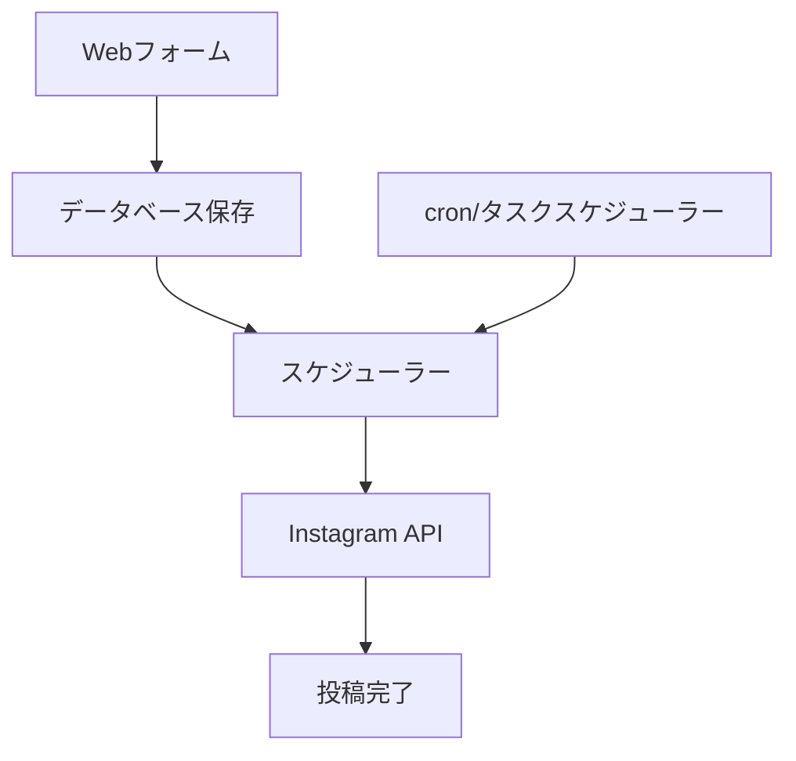
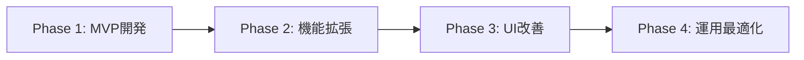

# Instagram予約投稿システム開発リサーチ

**作成日**: 2025-07-02  
**目的**: Instagram予約投稿機能開発のための技術調査  
**対象**: 1ページで画像・動画・キャプション・日付を入力して予約投稿できるシステム

---

## 📋 調査概要

### 背景
Instagram公式APIを使用して、Webページで画像/動画・キャプション・投稿日時を入力することで、指定した日時に自動投稿される予約投稿システムの開発可能性を調査。

### 調査結果サマリー
- ✅ Instagram Graph APIによる投稿機能は利用可能
- ❌ **公式APIには予約投稿機能は存在しない**
- ✅ カスタム予約システムの開発が必要
- ✅ ビジネスアカウント必須
- ⚠️ API制限・セキュリティ要件あり

---

## 🔧 Instagram Content Publishing API 詳細

### 基本API仕様

#### 主要エンドポイント
```http
POST /{IG_ID}/media                    # メディアコンテナ作成
POST /{IG_ID}/media_publish           # メディア公開
GET  /{IG_ID}/content_publishing_limit # 投稿制限確認
```

#### サポート対象
- **画像**: JPEG形式のみ
- **動画**: MP4形式、最大100MB
- **カルーセル**: 最大10枚の画像/動画
- **リール**: 短尺動画投稿

#### API制限
```json
{
  "rate_limit": "100投稿/24時間",
  "upload_limit": "画像: 8MB、動画: 100MB",
  "carousel_limit": "最大10アイテム"
}
```

---

## 🚫 予約投稿に関する制約

### 公式API制限
1. **ネイティブスケジューリング機能なし**
   - Instagram Graph APIには予約投稿機能が存在しない
   - 即座の投稿のみサポート

2. **サードパーティツール依存**
   - Meta Business Suite経由でのみ予約投稿可能
   - 公式パートナーツールの利用推奨

### APIセキュリティ変更（2024年）
```markdown
- 2018年: Instagram公開API廃止
- 2024年: API呼び出し制限を5,000→200回/時間に削減
- 承認されていないアプリの利用リスク増大
```

---

## 💡 予約投稿システム実装戦略

### アプローチ1: カスタムスケジューラー開発

#### システム構成


#### 技術スタック
```yaml
フロントエンド:
  - React/Vue.js (フォーム画面)
  - ファイルアップロード機能
  - 日時選択コンポーネント

バックエンド:
  - Node.js/Python (API サーバー)
  - データベース (投稿データ保存)
  - スケジューラー (cron/タスクキュー)

Instagram連携:
  - Instagram Graph API
  - Meta Business SDK
```

### アプローチ2: Meta Business Suite連携

#### 利点・制約
```diff
+ 公式サポートされた予約投稿
+ セキュリティリスクなし
+ 安定した機能提供

- UI/UXのカスタマイズ不可
- 外部サービス依存
- ブランディング制約
```

---

## 🔐 必要な認証・権限

### Instagram Business Account要件
```json
{
  "account_type": "Business または Creator",
  "facebook_page": "連携済みFacebookページ必須",
  "developer_account": "Facebook Developer Account",
  "permissions": [
    "instagram_basic",
    "instagram_content_publish",
    "pages_read_engagement"
  ]
}
```

### API アクセストークン
```javascript
// アクセストークン取得例
const accessToken = await getInstagramAccessToken({
  appId: process.env.FACEBOOK_APP_ID,
  appSecret: process.env.FACEBOOK_APP_SECRET,
  pageId: process.env.FACEBOOK_PAGE_ID
});
```

---

## 📊 実装仕様設計

### データベース設計

#### scheduled_posts テーブル
```sql
CREATE TABLE scheduled_posts (
    id SERIAL PRIMARY KEY,
    user_id VARCHAR(255) NOT NULL,
    instagram_account_id VARCHAR(255) NOT NULL,
    
    -- メディア情報
    media_type ENUM('IMAGE', 'VIDEO', 'CAROUSEL_ALBUM') NOT NULL,
    media_urls JSON NOT NULL, -- ['url1', 'url2'] for carousel
    caption TEXT,
    
    -- スケジュール情報
    scheduled_time TIMESTAMP WITH TIME ZONE NOT NULL,
    timezone VARCHAR(50) DEFAULT 'UTC',
    
    -- 状態管理
    status ENUM('PENDING', 'PROCESSING', 'PUBLISHED', 'FAILED') DEFAULT 'PENDING',
    published_at TIMESTAMP WITH TIME ZONE,
    instagram_post_id VARCHAR(255),
    error_message TEXT,
    
    -- メタデータ
    created_at TIMESTAMP WITH TIME ZONE DEFAULT NOW(),
    updated_at TIMESTAMP WITH TIME ZONE DEFAULT NOW()
);
```

### API エンドポイント設計

#### 1. 予約投稿作成
```http
POST /api/scheduled-posts
Content-Type: multipart/form-data

{
  "caption": "投稿キャプション",
  "scheduled_time": "2025-07-03T15:00:00+09:00",
  "media_files": [FileObject],
  "media_type": "IMAGE"
}
```

#### 2. 投稿実行処理
```javascript
// スケジューラー実行ロジック
async function executeScheduledPosts() {
  const pendingPosts = await getPendingPosts();
  
  for (const post of pendingPosts) {
    try {
      // 1. メディアコンテナ作成
      const container = await createMediaContainer(post);
      
      // 2. メディア公開
      const result = await publishMedia(container.id);
      
      // 3. 状態更新
      await updatePostStatus(post.id, 'PUBLISHED', result.id);
      
    } catch (error) {
      await updatePostStatus(post.id, 'FAILED', null, error.message);
    }
  }
}
```

---

## 🎨 UI/UX 設計

### フォーム画面構成
```jsx
const ScheduledPostForm = () => {
  return (
    <div className="scheduled-post-form">
      {/* メディアアップロード */}
      <MediaUploader 
        accept="image/*,video/*"
        multiple={true}
        maxFiles={10}
        onUpload={handleMediaUpload}
      />
      
      {/* キャプション入力 */}
      <TextArea
        placeholder="キャプションを入力..."
        maxLength={2200}
        value={caption}
        onChange={setCaption}
      />
      
      {/* 日時選択 */}
      <DateTimePicker
        value={scheduledTime}
        onChange={setScheduledTime}
        timezone="Asia/Tokyo"
        minDate={new Date()}
      />
      
      {/* 投稿ボタン */}
      <Button 
        onClick={handleSchedule}
        disabled={!isValid}
      >
        予約投稿を設定
      </Button>
    </div>
  );
};
```

### 投稿管理画面
```jsx
const ScheduledPostsList = () => {
  return (
    <div className="posts-list">
      {posts.map(post => (
        <PostCard key={post.id}>
          <MediaPreview urls={post.media_urls} />
          <PostInfo
            caption={post.caption}
            scheduledTime={post.scheduled_time}
            status={post.status}
          />
          <ActionButtons
            onEdit={() => editPost(post.id)}
            onDelete={() => deletePost(post.id)}
            onReschedule={() => reschedulePost(post.id)}
          />
        </PostCard>
      ))}
    </div>
  );
};
```

---

## ⚠️ 注意点・制約事項

### 技術的制約
1. **メディアホスティング**
   - アップロードファイルを公開URLでアクセス可能にする必要
   - CDN/ストレージサービス（S3, Cloudinary等）必須

2. **タイムゾーン処理**
   ```javascript
   // タイムゾーンを考慮した日時処理
   const scheduledTime = moment.tz(userInput, userTimezone).utc();
   ```

3. **エラーハンドリング**
   - API制限超過時の再試行ロジック
   - メディアアップロード失敗時の処理
   - ネットワークエラー対応

### 運用上の注意
```markdown
1. Instagram利用規約の遵守
2. 大量投稿による一時的なアカウント制限リスク
3. API変更への対応（年1-2回のアップデート）
4. セキュリティ監査（アクセストークン管理）
```

---

## 📈 実装ロードマップ

### Phase 1: 基本機能実装 (2-3週間)
- [ ] Instagram API連携
- [ ] 基本的な投稿機能
- [ ] データベース設計・構築
- [ ] 簡易UI実装

### Phase 2: 予約機能実装 (2-3週間)
- [ ] スケジューラー実装
- [ ] 予約投稿CRUD機能
- [ ] 状態管理システム
- [ ] エラーハンドリング

### Phase 3: UI/UX改善 (1-2週間)
- [ ] レスポンシブデザイン
- [ ] メディアプレビュー機能
- [ ] 投稿管理ダッシュボード
- [ ] 通知機能

### Phase 4: 運用・保守機能 (1週間)
- [ ] ログ・監視機能
- [ ] バックアップ・復旧
- [ ] パフォーマンス最適化
- [ ] セキュリティ監査

---

## 💰 コスト見積もり

### 開発コスト
```yaml
人件費:
  - フロントエンド開発: 40-60時間
  - バックエンド開発: 60-80時間
  - API連携・テスト: 30-40時間
  - 合計: 130-180時間

インフラコスト:
  - サーバー: $20-50/月
  - ストレージ: $10-30/月
  - CDN: $5-20/月
  - 合計: $35-100/月
```

### ライセンス・API
```markdown
- Instagram Graph API: 無料（制限あり）
- Facebook Developer Account: 無料
- サードパーティツール（オプション）: $29-199/月
```

---

## 🎯 結論・推奨事項

### 技術的実現可能性: ✅ **可能**

Instagram予約投稿システムの開発は技術的に実現可能です。ただし、以下の制約を理解した上での実装が必要：

1. **カスタムスケジューラーの開発が必須**
2. **Instagram Business Account必須**  
3. **メディアホスティング環境の構築必要**
4. **API制限の考慮が重要**

### 推奨実装アプローチ



**最優先**: 基本的な予約投稿機能を持つMVPを先行開発し、段階的に機能を拡張する戦略を推奨します。

---

**参考資料**:
- [Instagram Platform Documentation](https://developers.facebook.com/docs/instagram-platform/)
- [Meta Business Suite API](https://developers.facebook.com/docs/marketing-api/)
- [Instagram API Rate Limits](https://developers.facebook.com/docs/graph-api/overview/rate-limiting/)