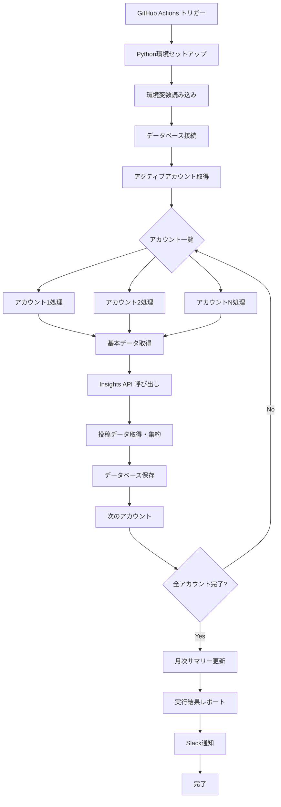
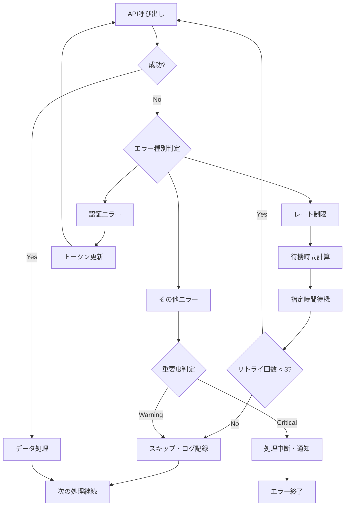

# GitHub Actions日次データ取得実装戦略

**作成日**: 2025-06-25  
**目的**: Instagram API を使用した日次データ取得の自動化実装計画  
**実行環境**: GitHub Actions + Supabase PostgreSQL  

---

## 📋 実装戦略概要

### 基本方針
- **GitHub Actions**: 定期実行とワークフロー管理
- **Python スクリプト**: データ取得・処理ロジック
- **Supabase**: データベース保存
- **環境変数**: 機密情報の安全な管理
- **エラーハンドリング**: 堅牢な障害対応

### 実行頻度
- **日次実行**: 毎日 06:00 JST (21:00 UTC)
- **手動実行**: 必要時にワークフロー手動トリガー
- **リトライ機能**: エラー時の自動再実行

---

## 🏗️ ディレクトリ構造とファイル配置

```
instagram-analysis-4/
├── .github/
│   └── workflows/
│       ├── daily-data-collection.yml          # メインワークフロー
│       └── test-data-collection.yml           # テスト用ワークフロー
│
├── scripts/
│   └── data-collection/
│       ├── main.py                             # メインエントリーポイント
│       ├── instagram_api_client.py             # Instagram API クライアント
│       ├── database_manager.py                 # データベース操作
│       ├── data_aggregator.py                  # データ集約処理
│       ├── error_handler.py                    # エラーハンドリング
│       └── config.py                           # 設定管理
│
├── requirements/
│   └── data-collection.txt                    # Python依存関係
│
└── docs/
    └── operations/
        ├── data-collection-runbook.md         # 運用ガイド
        └── troubleshooting.md                 # トラブルシューティング
```

---

## 📂 ファイル別実装内容

### 1. GitHub Actions ワークフロー

#### `.github/workflows/daily-data-collection.yml`
```yaml
# 役割: 日次データ取得の自動実行
# 機能:
# - 定期実行スケジュール (cron)
# - 手動実行トリガー
# - Python環境セットアップ
# - スクリプト実行
# - エラー通知

# 実装内容:
# - Python 3.11 環境構築
# - 依存関係インストール
# - 環境変数設定
# - データ取得スクリプト実行
# - Slack通知 (成功/失敗)
```

#### `.github/workflows/test-data-collection.yml`
```yaml
# 役割: プルリクエスト時のテスト実行
# 機能:
# - コード変更時の自動テスト
# - データ取得ロジックの検証
# - サンプルデータでの動作確認
```

### 2. Python データ取得スクリプト

#### `scripts/data-collection/main.py`
```python
# 役割: メインエントリーポイント
# 機能:
# - 全体の処理フロー制御
# - アカウント一覧の取得
# - 各アカウントのデータ収集実行
# - 結果サマリーの出力
# - エラーログの記録

# 主要処理:
# 1. データベース接続
# 2. アクティブなInstagramアカウント取得
# 3. 各アカウントの日次データ収集
# 4. 月次サマリー更新 (月末のみ)
# 5. 実行結果レポート生成
```

#### `scripts/data-collection/instagram_api_client.py`
```python
# 役割: Instagram Graph API クライアント
# 機能:
# - API認証管理
# - レート制限対応
# - 各種データ取得メソッド
# - エラーハンドリング

# 主要メソッド:
# - get_basic_account_data()     # 基本アカウント情報
# - get_insights_metrics()       # Insights API データ
# - get_posts_for_date()         # 投稿データ取得
# - get_post_metrics()           # 投稿メトリクス
# - handle_rate_limit()          # レート制限処理
```

#### `scripts/data-collection/database_manager.py`
```python
# 役割: データベース操作管理
# 機能:
# - Supabase接続管理
# - CRUD操作
# - トランザクション管理
# - データ整合性チェック

# 主要メソッド:
# - get_active_accounts()        # アクティブアカウント取得
# - save_daily_stats()           # 日次統計保存
# - save_post_data()             # 投稿データ保存
# - save_post_metrics()          # 投稿メトリクス保存
# - generate_monthly_summary()   # 月次サマリー生成
```

#### `scripts/data-collection/data_aggregator.py`
```python
# 役割: データ集約・計算処理
# 機能:
# - 投稿データの日別集約
# - エンゲージメント率計算
# - メディアタイプ分布算出
# - データ品質スコア計算

# 主要メソッド:
# - aggregate_daily_posts()      # 日別投稿集約
# - calculate_engagement_rate()  # エンゲージメント率
# - calculate_data_quality()     # データ品質スコア
# - format_media_distribution()  # メディアタイプ分布
```

#### `scripts/data-collection/error_handler.py`
```python
# 役割: エラーハンドリング・ログ管理
# 機能:
# - 例外処理の統一化
# - ログ出力管理
# - リトライロジック
# - 通知管理

# 主要機能:
# - API エラーの分類・処理
# - レート制限時の待機処理
# - データベースエラー対応
# - Slack通知送信
```

#### `scripts/data-collection/config.py`
```python
# 役割: 設定・定数管理
# 機能:
# - 環境変数の読み込み
# - API設定値の管理
# - データベース接続設定
# - ログ設定

# 設定項目:
# - Instagram API エンドポイント
# - レート制限設定
# - リトライ設定
# - ログレベル設定
```

---

## 🔄 データ取得フロー詳細

### メインワークフロー


### エラーハンドリングフロー


---

## 🔐 環境変数・シークレット管理

### GitHub Secrets
```yaml
# Instagram API
INSTAGRAM_ACCESS_TOKENS: '[{"account_id": "xxx", "token": "yyy"}, ...]'
FACEBOOK_APP_ID: 'your_app_id'
FACEBOOK_APP_SECRET: 'your_app_secret'

# Database
SUPABASE_URL: 'https://xxx.supabase.co'
SUPABASE_KEY: 'your_supabase_anon_key'
DATABASE_URL: 'postgresql://...'

# Notifications
SLACK_WEBHOOK_URL: 'https://hooks.slack.com/...'

# Encryption
DATA_ENCRYPTION_KEY: 'your_32_byte_key'
```

### 環境変数の使用方法
```python
# config.py での読み込み例
import os
import json

class Config:
    # Instagram API
    INSTAGRAM_TOKENS = json.loads(os.getenv('INSTAGRAM_ACCESS_TOKENS', '[]'))
    FACEBOOK_APP_ID = os.getenv('FACEBOOK_APP_ID')
    FACEBOOK_APP_SECRET = os.getenv('FACEBOOK_APP_SECRET')
    
    # Database
    DATABASE_URL = os.getenv('DATABASE_URL')
    
    # Rate Limiting
    API_RATE_LIMIT = 200  # calls per hour
    RETRY_MAX_ATTEMPTS = 3
    RETRY_DELAY_BASE = 60  # seconds
```

---

## 📊 ログ・監視戦略

### ログレベル
```python
# ログ設定
logging.basicConfig(
    level=logging.INFO,
    format='%(asctime)s - %(name)s - %(levelname)s - %(message)s'
)

# ログ出力例
logger.info(f"Started data collection for account: {username}")
logger.warning(f"Rate limit hit for account: {username}, waiting...")
logger.error(f"Failed to fetch data for account: {username}, error: {error}")
```

### Slack通知
```python
# 成功通知
{
    "text": "✅ Daily data collection completed",
    "blocks": [
        {
            "type": "section",
            "text": {
                "type": "mrkdwn",
                "text": "*Accounts processed:* 5/5\n*Total API calls:* 15\n*Duration:* 2m 34s"
            }
        }
    ]
}

# エラー通知
{
    "text": "❌ Daily data collection failed",
    "blocks": [
        {
            "type": "section",
            "text": {
                "type": "mrkdwn",
                "text": "*Error:* Rate limit exceeded\n*Account:* @example_account\n*Action:* Check API usage"
            }
        }
    ]
}
```

---

## 🧪 テスト戦略

### 単体テスト
```python
# tests/test_instagram_api_client.py
def test_get_basic_account_data():
    # モックAPIレスポンスでの基本データ取得テスト
    
def test_rate_limit_handling():
    # レート制限時の適切な処理テスト
    
def test_error_handling():
    # 各種エラーケースの処理テスト
```

### 統合テスト
```python
# tests/test_data_collection_flow.py
def test_daily_collection_flow():
    # サンプルアカウントでの全体フローテスト
    
def test_database_operations():
    # データベース操作の統合テスト
```

### GitHub Actions テスト
```yaml
# テスト用ワークフロー
# - プルリクエスト時実行
# - モックデータでの動作確認
# - コードカバレッジ測定
```

---

## ⚡ パフォーマンス最適化

### 並行処理
```python
# アカウント並行処理（レート制限考慮）
import asyncio
from concurrent.futures import ThreadPoolExecutor

async def process_accounts_parallel(accounts):
    # 最大3アカウント同時処理（レート制限対応）
    semaphore = asyncio.Semaphore(3)
    
    async def process_account_with_limit(account):
        async with semaphore:
            return await process_account(account)
    
    tasks = [process_account_with_limit(acc) for acc in accounts]
    return await asyncio.gather(*tasks, return_exceptions=True)
```

### キャッシュ戦略
```python
# 重複API呼び出し防止
from functools import lru_cache
from datetime import datetime, timedelta

@lru_cache(maxsize=100)
def get_account_data_cached(account_id, date_key):
    # 同日の重複取得防止
    return get_account_data(account_id)
```

---

## 🚀 実装順序

### Phase 1: 基本実装 (1週間)
1. **GitHub Actions ワークフロー** - 基本的な定期実行
2. **main.py** - エントリーポイント
3. **instagram_api_client.py** - 基本API呼び出し
4. **database_manager.py** - 基本的なDB操作
5. **手動テスト** - 1アカウントでの動作確認

### Phase 2: 機能拡張 (1週間)
1. **data_aggregator.py** - データ集約処理
2. **error_handler.py** - エラーハンドリング
3. **複数アカウント対応** - 並行処理実装
4. **Slack通知** - 実行結果通知

### Phase 3: 運用安定化 (1週間)
1. **テスト自動化** - 単体・統合テスト
2. **ログ・監視** - 詳細なログ出力
3. **リトライロジック** - 障害時の自動復旧
4. **ドキュメント** - 運用ガイド作成

### Phase 4: 最適化 (1週間)
1. **パフォーマンス調整** - 並行処理最適化
2. **月次処理** - 月末の自動サマリー生成
3. **アラート機能** - 異常値検知
4. **運用監視ダッシュボード** - 実行状況可視化

---

## 📋 運用チェックリスト

### デプロイ前確認
- [ ] 全環境変数の設定完了
- [ ] テスト実行の成功確認
- [ ] Slack通知の動作確認
- [ ] データベース接続確認
- [ ] API トークンの有効性確認

### 日次監視項目
- [ ] ワークフロー実行状況
- [ ] API使用量 (200コール/時間以内)
- [ ] データ取得成功率
- [ ] エラーログの確認
- [ ] データベース容量

### 週次メンテナンス
- [ ] API トークンの期限確認
- [ ] データ品質レポート確認
- [ ] パフォーマンス指標確認
- [ ] エラー傾向分析

---

この戦略により、**堅牢で保守しやすい日次データ取得システム**を構築できます。実装は段階的に進め、各フェーズで動作確認を行いながら機能を拡張していきます。