# Instagram Analysis DB Design

## 設計方針

### 1. マルチテナント対応
- 複数のInstagramアカウントを効率的に管理
- テナント（サービス利用企業）ごとのデータ分離
- スケーラブルな構造で大量データに対応

### 2. 時系列データ最適化
- 年間、月間、日別でのメトリクス集計
- 効率的なクエリ実行のためのインデックス設計
- データ圧縮とパーティショニング対応

### 3. API制約対応
- レート制限（200コール/時間）に対応した呼び出し管理
- アクセストークンの安全な管理とリフレッシュ機能
- エラーハンドリングと再実行機能

## ER図

```mermaid
erDiagram
    %% テナント・ユーザー管理
    tenants {
        uuid id PK
        string company_name
        string contact_email
        string subscription_plan
        timestamp created_at
        timestamp updated_at
    }

    users {
        uuid id PK
        uuid tenant_id FK
        string email
        string password_hash
        string name
        string role
        timestamp created_at
        timestamp updated_at
    }

    %% Instagram アカウント管理
    instagram_accounts {
        uuid id PK
        uuid tenant_id FK
        string instagram_user_id
        string username
        string account_type
        text encrypted_access_token
        timestamp token_expires_at
        string profile_picture_url
        boolean is_active
        timestamp created_at
        timestamp updated_at
    }

    instagram_tokens {
        uuid id PK
        uuid instagram_account_id FK
        text access_token_encrypted
        string token_type
        timestamp expires_at
        timestamp last_refreshed_at
        text refresh_token_encrypted
        timestamp created_at
    }

    %% API呼び出し管理
    api_call_logs {
        uuid id PK
        uuid instagram_account_id FK
        string endpoint
        string method
        json request_params
        integer response_status
        json response_data
        integer rate_limit_remaining
        timestamp called_at
    }

    rate_limit_status {
        uuid id PK
        uuid instagram_account_id FK
        integer calls_count
        timestamp hour_window_start
        timestamp last_call_at
        boolean is_limited
    }

    %% 基本プロフィールデータ
    profile_snapshots {
        uuid id PK
        uuid instagram_account_id FK
        integer followers_count
        integer following_count
        integer media_count
        integer profile_views
        date snapshot_date
        timestamp created_at
    }

    %% 投稿データ
    instagram_media {
        uuid id PK
        uuid instagram_account_id FK
        string media_id
        string media_type
        text caption
        string media_url
        string thumbnail_url
        string permalink
        timestamp published_at
        timestamp created_at
        timestamp updated_at
    }

    %% 投稿メトリクス（時系列）
    media_metrics {
        uuid id PK
        uuid media_id FK
        integer likes_count
        integer comments_count
        integer saves_count
        integer shares_count
        integer views_count
        integer reach
        integer impressions
        decimal engagement_rate
        timestamp recorded_at
    }

    %% 日別集計データ
    daily_analytics {
        uuid id PK
        uuid instagram_account_id FK
        date analytics_date
        integer new_followers
        integer unfollowers
        integer profile_views
        integer website_clicks
        integer reach
        integer impressions
        integer total_likes
        integer total_comments
        integer total_saves
        integer total_shares
        decimal avg_engagement_rate
        timestamp created_at
        timestamp updated_at
    }

    %% 月別集計データ
    monthly_analytics {
        uuid id PK
        uuid instagram_account_id FK
        integer year
        integer month
        integer total_followers_start
        integer total_followers_end
        integer net_followers_change
        integer total_media_posted
        integer total_profile_views
        integer total_website_clicks
        integer total_reach
        integer total_impressions
        integer total_likes
        integer total_comments
        integer total_saves
        integer total_shares
        decimal avg_engagement_rate
        timestamp created_at
        timestamp updated_at
    }

    %% 年別集計データ
    yearly_analytics {
        uuid id PK
        uuid instagram_account_id FK
        integer year
        integer total_followers_start
        integer total_followers_end
        integer net_followers_change
        integer total_media_posted
        integer total_profile_views
        integer total_website_clicks
        integer total_reach
        integer total_impressions
        integer total_likes
        integer total_comments
        integer total_saves
        integer total_shares
        decimal avg_engagement_rate
        timestamp created_at
        timestamp updated_at
    }

    %% データ取得ジョブ管理
    data_sync_jobs {
        uuid id PK
        uuid instagram_account_id FK
        string job_type
        string status
        json sync_params
        timestamp started_at
        timestamp completed_at
        text error_message
        integer retry_count
    }

    %% キャッシュ管理
    analytics_cache {
        uuid id PK
        uuid instagram_account_id FK
        string cache_key
        string data_type
        json cached_data
        timestamp expires_at
        timestamp created_at
    }

    %% リレーション
    tenants ||--o{ users : "has"
    tenants ||--o{ instagram_accounts : "manages"
    instagram_accounts ||--o{ instagram_tokens : "has"
    instagram_accounts ||--o{ api_call_logs : "generates"
    instagram_accounts ||--o{ rate_limit_status : "tracks"
    instagram_accounts ||--o{ profile_snapshots : "has"
    instagram_accounts ||--o{ instagram_media : "posts"
    instagram_accounts ||--o{ daily_analytics : "generates"
    instagram_accounts ||--o{ monthly_analytics : "aggregates"
    instagram_accounts ||--o{ yearly_analytics : "summarizes"
    instagram_accounts ||--o{ data_sync_jobs : "processes"
    instagram_accounts ||--o{ analytics_cache : "caches"
    instagram_media ||--o{ media_metrics : "tracks"
```



## テーブル設計詳細

### 1. テナント・ユーザー管理

#### tenants（テナント）
- マルチテナント対応の基盤テーブル
- 企業・組織単位でのデータ分離
- サブスクリプションプラン管理

#### users（ユーザー）
- テナント配下のユーザー管理
- ロールベースアクセス制御対応

### 2. Instagram アカウント管理

#### instagram_accounts（Instagramアカウント）
- テナント配下の複数Instagramアカウント管理
- アクセストークンの暗号化保存
- アカウント状態管理

#### instagram_tokens（トークン管理）
- アクセストークンの詳細管理
- 自動リフレッシュ機能対応
- セキュリティ強化のための分離

### 3. API制約対応

#### api_call_logs（API呼び出しログ）
- 全API呼び出しの詳細記録
- レート制限対応のための使用量追跡
- デバッグとエラー解析

#### rate_limit_status（レート制限状況）
- 時間窓ごとのAPI使用量管理
- リアルタイムでの制限状況追跡

### 4. 時系列データ管理

#### profile_snapshots（プロフィールスナップショット）
- 日別のプロフィール基本情報
- フォロワー数等の推移追跡

#### instagram_media（投稿データ）
- 投稿の基本情報管理
- メディアタイプ別対応

#### media_metrics（投稿メトリクス）
- 投稿ごとの詳細メトリクス
- 時系列での変化追跡

### 5. 集計データ

#### daily_analytics（日別分析）
- 日単位での集計データ
- 月間分析画面で使用

#### monthly_analytics（月別分析）
- 月単位での集計データ
- 年間分析画面で使用

#### yearly_analytics（年別分析）
- 年単位での集計データ
- 長期トレンド分析

### 6. システム管理

#### data_sync_jobs（データ同期ジョブ）
- バックグラウンドでのデータ取得管理
- エラー処理と再実行機能

#### analytics_cache（分析キャッシュ）
- 頻繁にアクセスされるデータのキャッシュ
- パフォーマンス最適化

## インデックス設計

### 主要インデックス
```sql
-- 時系列クエリ最適化
CREATE INDEX idx_daily_analytics_account_date ON daily_analytics(instagram_account_id, analytics_date);
CREATE INDEX idx_monthly_analytics_account_year_month ON monthly_analytics(instagram_account_id, year, month);
CREATE INDEX idx_media_metrics_media_recorded ON media_metrics(media_id, recorded_at);

-- テナント分離
CREATE INDEX idx_instagram_accounts_tenant ON instagram_accounts(tenant_id, is_active);
CREATE INDEX idx_users_tenant ON users(tenant_id);

-- API制限管理
CREATE INDEX idx_rate_limit_account_window ON rate_limit_status(instagram_account_id, hour_window_start);
CREATE INDEX idx_api_logs_account_called ON api_call_logs(instagram_account_id, called_at);

-- キャッシュ管理
CREATE INDEX idx_analytics_cache_key_expires ON analytics_cache(cache_key, expires_at);
```

## セキュリティ対策

### 1. 暗号化
- アクセストークンの暗号化保存
- 機密データの保護

### 2. アクセス制御
- テナント単位でのデータ分離
- ロールベースアクセス制御

### 3. 監査ログ
- API呼び出しの完全な記録
- データアクセスの追跡

## パフォーマンス最適化

### 1. パーティショニング
```sql
-- 時系列データのパーティショニング
PARTITION BY RANGE (analytics_date) (
    PARTITION p_2024_01 VALUES LESS THAN ('2024-02-01'),
    PARTITION p_2024_02 VALUES LESS THAN ('2024-03-01'),
    ...
);
```

### 2. データ圧縮
- 古いデータの圧縮
- ストレージ効率化

### 3. キャッシュ戦略
- 頻繁にアクセスされるデータのキャッシュ
- TTL設定による自動更新

## スケーラビリティ

### 1. 水平分散
- テナント単位でのシャーディング対応
- 読み取り専用レプリカの活用

### 2. データライフサイクル
- 古いデータのアーカイブ
- 自動削除ポリシー

### 3. 監視とアラート
- パフォーマンス監視
- 容量監視とアラート