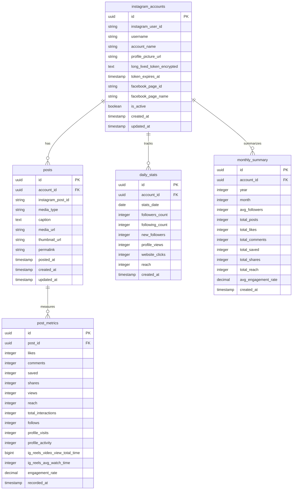

# Simple Instagram Analysis DB Design (API検証結果反映版)

**最終更新**: 2025-06-25  
**基準**: Instagram Graph API 実検証結果  
**参照**: `/docs/report/01-instagram-post-data-acquisition-report.md`

## 設計方針

### 必要最低限のシンプル構造
- 複雑なマルチテナント機能は除外
- 現在のフロントエンド機能をサポートする最小構成
- **実際のAPI検証結果に基づく実用的な設計**
- メンテナンスしやすいシンプルな関係

## ER図



## テーブル詳細

### 1. instagram_accounts（Instagramアカウント）
- **目的**: 基本的なアカウント情報とトークン管理
- **重要フィールド**:
  - `instagram_user_id`: Instagram Business Account ID (例: 17841455808057230)
  - `username`: @から始まるユーザーネーム（ヘッダー表示用）
  - `account_name`: 表示名（ヘッダー表示用）
  - `profile_picture_url`: アイコンURL（ヘッダー表示用）
  - `long_lived_token_encrypted`: 暗号化された長期アクセストークン
  - `token_expires_at`: トークン有効期限（約60日）
  - `facebook_page_id`: 紐付いているFacebookページID
  - `facebook_page_name`: 紐付いているFacebookページ名
  - `is_active`: アカウント有効状態

### 2. posts（投稿データ）
- **目的**: Instagram投稿の基本情報
- **API検証結果**: 全フィールド取得確認済み
- **重要フィールド**:
  - `instagram_post_id`: Instagram投稿ID（API: `id`）
  - `media_type`: メディアタイプ（VIDEO/CAROUSEL_ALBUM/IMAGE）
  - `caption`: キャプションテキスト
  - `media_url`: メディア本体URL
  - `thumbnail_url`: サムネイルURL（動画用）
  - `permalink`: Instagram投稿URL
  - `posted_at`: 投稿日時（API: `timestamp`）

### 3. post_metrics（投稿メトリクス）
- **目的**: 投稿のパフォーマンスデータ
- **API検証結果**: 実際に取得可能なメトリクスのみ定義

#### 全メディアタイプ共通メトリクス
- **基本エンゲージメント**:
  - `likes`: いいね数 ✅
  - `comments`: コメント数 ✅
  - `saved`: 保存数 ✅ (注: `saves`ではなく`saved`)
  - `shares`: シェア数 ✅
- **リーチ・視聴**:
  - `views`: 視聴回数 ✅
  - `reach`: リーチ数 ✅
  - `total_interactions`: 総インタラクション数 ✅
- **計算値**:
  - `engagement_rate`: エンゲージメント率（(likes+comments+saved+shares)/reach*100）

#### VIDEO専用メトリクス
- `ig_reels_video_view_total_time`: 総視聴時間（ミリ秒） ✅
- `ig_reels_avg_watch_time`: 平均視聴時間（ミリ秒） ✅

#### CAROUSEL_ALBUM専用メトリクス
- `follows`: フォロー数 ✅
- `profile_visits`: プロフィール訪問数 ✅
- `profile_activity`: プロフィールアクティビティ ✅

#### ❌ 取得不可能なメトリクス（削除済み）
- `impressions`: インプレッション数（API制限により取得不可）

### 4. daily_stats（日別統計）
- **目的**: 月間分析画面で使用する日別データ
- **重要フィールド**:
  - フォロワー系: `followers_count`, `new_followers`
  - アクティビティ系: `profile_views`, `website_clicks`
  - **注意**: `impressions`削除（取得不可のため）

### 5. monthly_summary（月別サマリー）
- **目的**: 年間分析画面で使用する月別集計データ
- **重要フィールド**:
  - 月間の合計値とaverageを事前計算して保存
  - **変更**: `total_saves` → `total_saved`（API仕様に合わせて）

## SQL定義

### posts テーブル
```sql
CREATE TABLE posts (
    id UUID PRIMARY KEY DEFAULT gen_random_uuid(),
    account_id UUID REFERENCES instagram_accounts(id),
    instagram_post_id VARCHAR(50) UNIQUE NOT NULL,
    media_type VARCHAR(20) NOT NULL,
    caption TEXT,
    media_url TEXT,
    thumbnail_url TEXT,
    permalink TEXT,
    posted_at TIMESTAMP WITH TIME ZONE NOT NULL,
    created_at TIMESTAMP WITH TIME ZONE DEFAULT NOW(),
    updated_at TIMESTAMP WITH TIME ZONE DEFAULT NOW()
);
```

### post_metrics テーブル
```sql
CREATE TABLE post_metrics (
    id UUID PRIMARY KEY DEFAULT gen_random_uuid(),
    post_id UUID REFERENCES posts(id) ON DELETE CASCADE,
    
    -- 全メディアタイプ共通メトリクス
    likes INTEGER DEFAULT 0,
    comments INTEGER DEFAULT 0,
    saved INTEGER DEFAULT 0,                    -- APIでは'saved'
    shares INTEGER DEFAULT 0,
    views INTEGER DEFAULT 0,
    reach INTEGER DEFAULT 0,
    total_interactions INTEGER DEFAULT 0,
    
    -- CAROUSEL_ALBUM専用メトリクス
    follows INTEGER DEFAULT 0,
    profile_visits INTEGER DEFAULT 0,
    profile_activity INTEGER DEFAULT 0,
    
    -- VIDEO専用メトリクス
    ig_reels_video_view_total_time BIGINT DEFAULT 0,
    ig_reels_avg_watch_time INTEGER DEFAULT 0,
    
    -- 計算値
    engagement_rate DECIMAL(5,2) DEFAULT 0.00,
    
    recorded_at TIMESTAMP WITH TIME ZONE DEFAULT NOW()
);
```

## インデックス設計

```sql
-- 投稿データ用インデックス
CREATE INDEX idx_posts_account_posted ON posts(account_id, posted_at DESC);
CREATE INDEX idx_posts_media_type ON posts(account_id, media_type, posted_at DESC);
CREATE UNIQUE INDEX idx_posts_instagram_id ON posts(instagram_post_id);

-- メトリクス用インデックス
CREATE INDEX idx_post_metrics_post_recorded ON post_metrics(post_id, recorded_at DESC);
CREATE INDEX idx_post_metrics_engagement_rate ON post_metrics(engagement_rate DESC);

-- 時系列分析用インデックス
CREATE INDEX idx_daily_stats_account_date ON daily_stats(account_id, stats_date);
CREATE INDEX idx_monthly_summary_account_year_month ON monthly_summary(account_id, year, month);
```

## データフロー

### 1. データ取得（API検証済み）
```
Facebook Graph API → posts + post_metrics
- エンドポイント: graph.facebook.com (instagram.comではない)
- 投稿一覧: /{ig-user-id}/media
- メトリクス: /{ig-media-id}/insights
```

### 2. 集計処理
```
post_metrics → monthly_summary (saved集計)
daily_stats → monthly_summary (月次バッチ)
```

### 3. 画面表示
```
年間分析: monthly_summary
月間分析: daily_stats
投稿分析: posts + post_metrics
```

## API制約とDB設計への影響

### ✅ 取得可能データ
| メトリクス | API名 | DB列名 | 全メディア | VIDEO | CAROUSEL |
|-----------|-------|--------|----------|-------|----------|
| いいね数 | `likes` | `likes` | ✅ | ✅ | ✅ |
| コメント数 | `comments` | `comments` | ✅ | ✅ | ✅ |
| 保存数 | `saved` | `saved` | ✅ | ✅ | ✅ |
| シェア数 | `shares` | `shares` | ✅ | ✅ | ✅ |
| 視聴回数 | `views` | `views` | ✅ | ✅ | ✅ |
| リーチ数 | `reach` | `reach` | ✅ | ✅ | ✅ |
| 総インタラクション | `total_interactions` | `total_interactions` | ✅ | ✅ | ✅ |
| フォロー数 | `follows` | `follows` | ❌ | ❌ | ✅ |
| プロフィール訪問 | `profile_visits` | `profile_visits` | ❌ | ❌ | ✅ |
| 総視聴時間 | `ig_reels_video_view_total_time` | `ig_reels_video_view_total_time` | ❌ | ✅ | ❌ |
| 平均視聴時間 | `ig_reels_avg_watch_time` | `ig_reels_avg_watch_time` | ❌ | ✅ | ❌ |

### ❌ 取得不可能データ
- `impressions`: インプレッション数（API制限）
- `saves`: 正しくは `saved`

## レート制限対応

### 制限値
- **200コール/時間/ユーザー**
- 投稿25件 + メトリクス25件 = 50コール（約25分の投稿データを1時間で処理可能）

### 最適化戦略
1. **バッチ処理**: 25件ずつ投稿取得
2. **差分更新**: 新規投稿のみメトリクス取得
3. **メタ情報活用**: 投稿データから `like_count`, `comments_count` も取得可能

## フロントエンド互換性

### 現在のダミーデータとの対応
```typescript
interface PostInsight {
  id: string;                    // posts.instagram_post_id
  date: string;                  // posts.posted_at
  thumbnail: string;             // posts.thumbnail_url || posts.media_url
  type: "Story" | "Feed" | "Reels"; // posts.media_type (マッピング必要)
  reach: number;                 // post_metrics.reach
  likes: number;                 // post_metrics.likes
  comments: number;              // post_metrics.comments
  shares: number;                // post_metrics.shares
  saves: number;                 // post_metrics.saved (注意: saved)
  engagement_rate: number;       // post_metrics.engagement_rate
  view_rate?: number;           // 計算または別途取得
}
```

## 実装チェックリスト

### 必須対応事項
- [ ] `saves` → `saved` への変更対応
- [ ] `impressions` 削除への対応
- [ ] メディアタイプ別メトリクス取得ロジック
- [ ] Facebook Graph API エンドポイント使用
- [ ] レート制限(200コール/時間)対応

### データ品質保証
- [ ] NULL値許可設定（VIDEO専用メトリクスなど）
- [ ] エンゲージメント率計算ロジック
- [ ] メディアタイプ別バリデーション

この設計により、**実際のAPI検証結果に基づいた実用的で確実に動作するDB構造**を実現できます。