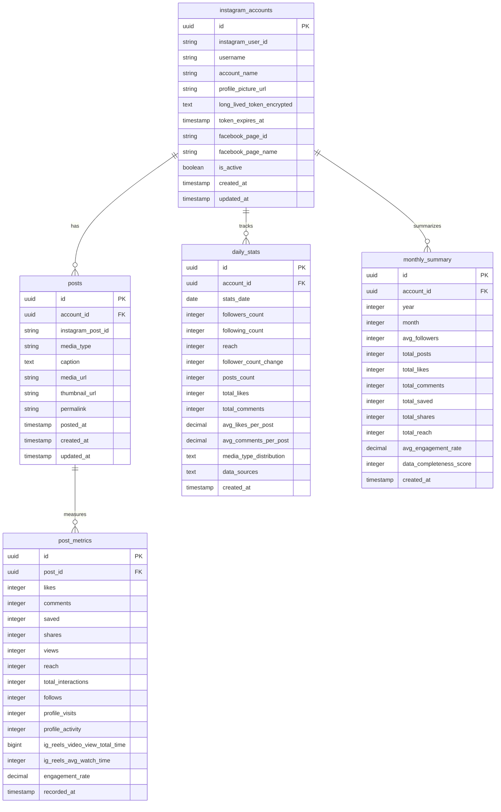
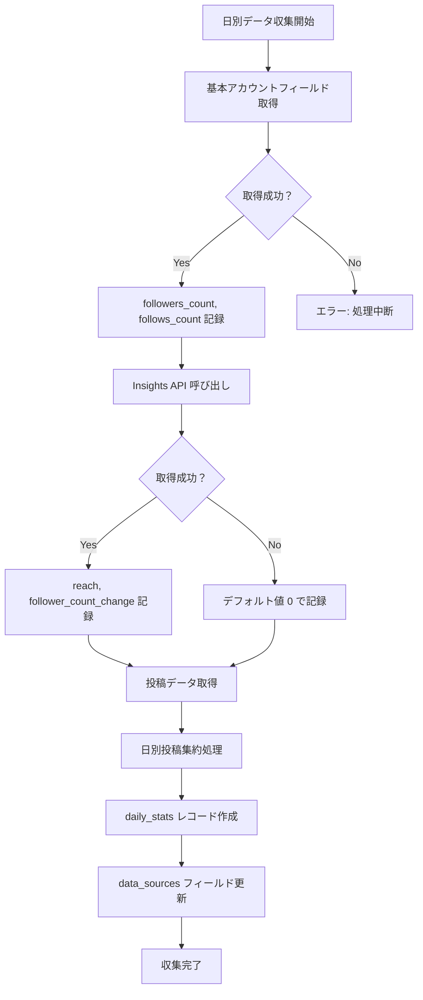

# Instagram Analysis DB Design (daily_stats 検証結果完全反映版)

**最終更新**: 2025-06-25  
**基準**: Instagram Graph API 投稿・日別統計データ完全検証結果  
**参照**: 
- `/docs/report/01-instagram-post-data-acquisition-report.md`
- `/docs/report/02-instagram-daily-stats-acquisition-report.md`

## 設計方針

### 実用性重視のシンプル構造
- **実際に取得可能なデータのみ**をテーブル設計に反映
- API制約を考慮した現実的な実装
- フロントエンド要件との完全な整合性
- メンテナンスしやすい関係設計

### API検証に基づく確実性
- 全フィールドの取得可能性を実際のAPIで検証済み
- エラーハンドリングを含む実装戦略
- レート制限を考慮したデータ収集設計

## ER図



## テーブル詳細

### 1. instagram_accounts（Instagramアカウント）
- **変更なし**: 投稿データ検証で全フィールド取得確認済み
- **追加フィールド**: 日別統計取得のためのメタ情報

```sql
CREATE TABLE instagram_accounts (
    id UUID PRIMARY KEY DEFAULT gen_random_uuid(),
    instagram_user_id VARCHAR(50) UNIQUE NOT NULL,
    username VARCHAR(100) NOT NULL,
    account_name VARCHAR(200),
    profile_picture_url TEXT,
    long_lived_token_encrypted TEXT NOT NULL,
    token_expires_at TIMESTAMP WITH TIME ZONE,
    facebook_page_id VARCHAR(50),
    facebook_page_name VARCHAR(200),
    is_active BOOLEAN DEFAULT true,
    
    -- 日別統計収集用メタ情報
    last_daily_collection_date DATE,
    daily_collection_enabled BOOLEAN DEFAULT true,
    
    created_at TIMESTAMP WITH TIME ZONE DEFAULT NOW(),
    updated_at TIMESTAMP WITH TIME ZONE DEFAULT NOW()
);
```

### 2. posts（投稿データ）
- **変更なし**: API検証で全フィールド取得確認済み

### 3. post_metrics（投稿メトリクス）
- **変更なし**: API検証で取得可能メトリクスのみ定義済み

### 4. daily_stats（日別統計）- **大幅改訂**

#### 実際に取得可能なデータに基づく設計
```sql
CREATE TABLE daily_stats (
    id UUID PRIMARY KEY DEFAULT gen_random_uuid(),
    account_id UUID REFERENCES instagram_accounts(id),
    stats_date DATE NOT NULL,
    
    -- ✅ 基本アカウントフィールドから取得（最も安定）
    followers_count INTEGER NOT NULL,           -- 基本フィールド: followers_count
    following_count INTEGER NOT NULL,           -- 基本フィールド: follows_count
    
    -- ✅ Insights API から取得（利用可能）
    reach INTEGER DEFAULT 0,                    -- Insights: reach (日別・週別対応)
    follower_count_change INTEGER DEFAULT 0,   -- Insights: follower_count (日別のみ)
    
    -- ✅ 投稿データ集約から算出
    posts_count INTEGER DEFAULT 0,             -- 投稿集約: その日の投稿数
    total_likes INTEGER DEFAULT 0,             -- 投稿集約: その日投稿されたコンテンツのいいね合計
    total_comments INTEGER DEFAULT 0,          -- 投稿集約: その日投稿されたコンテンツのコメント合計
    avg_likes_per_post DECIMAL(8,2) DEFAULT 0, -- 投稿集約: 平均いいね数
    avg_comments_per_post DECIMAL(8,2) DEFAULT 0, -- 投稿集約: 平均コメント数
    
    -- ✅ メタデータ（JSON形式）
    media_type_distribution TEXT,              -- 投稿集約: {"VIDEO": 2, "CAROUSEL_ALBUM": 1} など
    data_sources TEXT,                         -- データソース記録: ["basic_fields", "insights_api", "post_aggregation"]
    
    created_at TIMESTAMP WITH TIME ZONE DEFAULT NOW(),
    
    UNIQUE(account_id, stats_date)
);
```

#### ❌ 削除されたフィールド（取得不可のため）
```sql
-- 以下のフィールドは削除
-- new_followers        INTEGER,  -- 取得不可
-- profile_views        INTEGER,  -- 取得不可  
-- website_clicks       INTEGER,  -- 取得不可
-- impressions          INTEGER,  -- v22以降廃止
```

#### データソースの優先順位
1. **基本フィールド**: 最も安定、毎日確実に取得可能
2. **Insights API**: 追加情報、エラー時は基本フィールドで代替
3. **投稿集約**: 独自メトリクス、投稿がない日は0

### 5. monthly_summary（月別サマリー）- **更新**

#### daily_stats の新仕様に対応
```sql
CREATE TABLE monthly_summary (
    id UUID PRIMARY KEY DEFAULT gen_random_uuid(),
    account_id UUID REFERENCES instagram_accounts(id),
    year INTEGER NOT NULL,
    month INTEGER NOT NULL,
    
    -- daily_stats から集約
    avg_followers INTEGER,                      -- daily_stats.followers_count の月平均
    total_posts INTEGER,                        -- daily_stats.posts_count の月合計
    total_likes INTEGER,                        -- daily_stats.total_likes の月合計
    total_comments INTEGER,                     -- daily_stats.total_comments の月合計
    total_saved INTEGER,                        -- post_metrics.saved の月合計
    total_shares INTEGER,                       -- post_metrics.shares の月合計
    total_reach INTEGER,                        -- daily_stats.reach の月合計
    avg_engagement_rate DECIMAL(5,2),          -- post_metrics から算出
    
    -- データ品質指標
    data_completeness_score INTEGER DEFAULT 0, -- 0-100: データ収集完全性スコア
    daily_data_points INTEGER DEFAULT 0,       -- その月の daily_stats レコード数
    
    created_at TIMESTAMP WITH TIME ZONE DEFAULT NOW(),
    
    UNIQUE(account_id, year, month)
);
```

## データ収集戦略

### 1. 日別データ収集フロー



### 2. API呼び出し実装例

#### 基本フィールド取得（最優先）
```python
def get_basic_account_data(instagram_user_id, access_token):
    """最も安定した基本アカウントデータ取得"""
    url = f"https://graph.facebook.com/{instagram_user_id}"
    
    params = {
        'fields': 'followers_count,follows_count,media_count,username,name',
        'access_token': access_token
    }
    
    response = requests.get(url, params=params)
    response.raise_for_status()
    
    return response.json()
```

#### Insights API 取得（オプション）
```python
def get_insights_data(instagram_user_id, access_token, target_date):
    """Insights メトリクス取得（エラー時は継続）"""
    url = f"https://graph.facebook.com/{instagram_user_id}/insights"
    
    params = {
        'metric': 'follower_count,reach',
        'since': target_date,
        'until': target_date,
        'period': 'day',
        'access_token': access_token
    }
    
    try:
        response = requests.get(url, params=params)
        response.raise_for_status()
        
        data = response.json()
        metrics = {}
        
        for metric_data in data.get('data', []):
            metric_name = metric_data.get('name')
            values = metric_data.get('values', [])
            if values:
                metrics[metric_name] = values[0].get('value', 0)
        
        return metrics
        
    except Exception as e:
        logger.warning(f"Insights API エラー、デフォルト値使用: {e}")
        return {'follower_count': 0, 'reach': 0}
```

#### 投稿データ集約
```python
def aggregate_posts_for_date(instagram_user_id, access_token, target_date):
    """指定日の投稿データを集約"""
    
    # 投稿データ取得
    posts = get_posts_data(instagram_user_id, access_token)
    
    # 日別集約
    daily_aggregation = {
        'posts_count': 0,
        'total_likes': 0,
        'total_comments': 0,
        'media_types': []
    }
    
    for post in posts:
        post_date = post.get('timestamp', '').split('T')[0]
        
        if post_date == target_date:
            daily_aggregation['posts_count'] += 1
            daily_aggregation['total_likes'] += post.get('like_count', 0)
            daily_aggregation['total_comments'] += post.get('comments_count', 0)
            daily_aggregation['media_types'].append(post.get('media_type'))
    
    # 平均値計算
    if daily_aggregation['posts_count'] > 0:
        daily_aggregation['avg_likes_per_post'] = daily_aggregation['total_likes'] / daily_aggregation['posts_count']
        daily_aggregation['avg_comments_per_post'] = daily_aggregation['total_comments'] / daily_aggregation['posts_count']
    else:
        daily_aggregation['avg_likes_per_post'] = 0
        daily_aggregation['avg_comments_per_post'] = 0
    
    # メディアタイプ分布
    from collections import Counter
    daily_aggregation['media_type_distribution'] = json.dumps(
        dict(Counter(daily_aggregation['media_types']))
    )
    
    return daily_aggregation
```

### 3. 統合処理実装

#### 堅牢な日別データ収集
```python
def collect_daily_stats(account_id, instagram_user_id, access_token, target_date):
    """堅牢な日別統計データ収集"""
    
    daily_stats = {
        'account_id': account_id,
        'stats_date': target_date,
        'data_sources': []
    }
    
    # 1. 基本フィールド取得（必須）
    try:
        account_data = get_basic_account_data(instagram_user_id, access_token)
        daily_stats.update({
            'followers_count': account_data.get('followers_count', 0),
            'following_count': account_data.get('follows_count', 0)
        })
        daily_stats['data_sources'].append('basic_fields')
        
    except Exception as e:
        logger.error(f"基本フィールド取得失敗: {e}")
        return None  # 基本データなしでは処理不可
    
    # 2. Insights API 取得（オプション）
    try:
        insights_data = get_insights_data(instagram_user_id, access_token, target_date)
        daily_stats.update({
            'reach': insights_data.get('reach', 0),
            'follower_count_change': insights_data.get('follower_count', 0)
        })
        daily_stats['data_sources'].append('insights_api')
        
    except Exception as e:
        logger.warning(f"Insights API 取得失敗、デフォルト値使用: {e}")
        daily_stats.update({
            'reach': 0,
            'follower_count_change': 0
        })
    
    # 3. 投稿集約（オプション）
    try:
        posts_data = aggregate_posts_for_date(instagram_user_id, access_token, target_date)
        daily_stats.update({
            'posts_count': posts_data['posts_count'],
            'total_likes': posts_data['total_likes'],
            'total_comments': posts_data['total_comments'],
            'avg_likes_per_post': posts_data['avg_likes_per_post'],
            'avg_comments_per_post': posts_data['avg_comments_per_post'],
            'media_type_distribution': posts_data['media_type_distribution']
        })
        daily_stats['data_sources'].append('post_aggregation')
        
    except Exception as e:
        logger.warning(f"投稿集約失敗: {e}")
        daily_stats.update({
            'posts_count': 0,
            'total_likes': 0,
            'total_comments': 0,
            'avg_likes_per_post': 0,
            'avg_comments_per_post': 0,
            'media_type_distribution': '{}'
        })
    
    # データソース記録
    daily_stats['data_sources'] = json.dumps(daily_stats['data_sources'])
    
    return daily_stats
```

## インデックス設計

### 最適化されたインデックス
```sql
-- 日別統計用インデックス
CREATE INDEX idx_daily_stats_account_date ON daily_stats(account_id, stats_date DESC);
CREATE INDEX idx_daily_stats_date_range ON daily_stats(stats_date);
CREATE INDEX idx_daily_stats_followers ON daily_stats(account_id, followers_count);

-- 月別サマリー用インデックス
CREATE INDEX idx_monthly_summary_account_year_month ON monthly_summary(account_id, year DESC, month DESC);
CREATE INDEX idx_monthly_summary_completeness ON monthly_summary(data_completeness_score DESC);

-- 投稿データ用インデックス（変更なし）
CREATE INDEX idx_posts_account_posted ON posts(account_id, posted_at DESC);
CREATE INDEX idx_posts_media_type ON posts(account_id, media_type, posted_at DESC);
CREATE UNIQUE INDEX idx_posts_instagram_id ON posts(instagram_post_id);

-- メトリクス用インデックス（変更なし）
CREATE INDEX idx_post_metrics_post_recorded ON post_metrics(post_id, recorded_at DESC);
CREATE INDEX idx_post_metrics_engagement_rate ON post_metrics(engagement_rate DESC);
```

## API制約への対応

### レート制限最適化
```sql
-- API呼び出し記録テーブル（新規追加）
CREATE TABLE api_usage_log (
    id UUID PRIMARY KEY DEFAULT gen_random_uuid(),
    account_id UUID REFERENCES instagram_accounts(id),
    api_type VARCHAR(50) NOT NULL,              -- 'insights', 'basic_fields', 'posts'
    calls_count INTEGER DEFAULT 1,
    hour_window TIMESTAMP WITH TIME ZONE,       -- 1時間単位の集計
    success BOOLEAN DEFAULT true,
    created_at TIMESTAMP WITH TIME ZONE DEFAULT NOW()
);

-- 1時間あたりのAPI使用量チェック
CREATE INDEX idx_api_usage_hour_window ON api_usage_log(account_id, hour_window);
```

### レート制限チェック関数
```python
def check_rate_limit(account_id, api_type='insights'):
    """レート制限チェック（200コール/時間）"""
    
    current_hour = datetime.now().replace(minute=0, second=0, microsecond=0)
    
    # 過去1時間のAPI使用量確認
    usage = db.execute("""
        SELECT COALESCE(SUM(calls_count), 0) as total_calls
        FROM api_usage_log 
        WHERE account_id = %s 
        AND hour_window >= %s
    """, [account_id, current_hour - timedelta(hours=1)])
    
    total_calls = usage[0]['total_calls']
    
    if total_calls >= 180:  # 安全マージン
        logger.warning(f"レート制限近接: {total_calls}/200 コール")
        return False
    
    return True
```

## フロントエンド互換性

### 現在のダミーデータとの対応

#### 月間分析画面
```typescript
interface MonthlyInsight {
  date: string;                          // daily_stats.stats_date
  followers: number;                     // daily_stats.followers_count
  newFollowers: number;                  // daily_stats.follower_count_change
  profileViews: number;                  // 取得不可 → 0 or 計算値
  websiteClicks: number;                 // 取得不可 → 0
  reach: number;                         // daily_stats.reach
}
```

#### 年間分析画面
```typescript
interface YearlyData {
  month: string;                         // monthly_summary.year + month
  followers: number;                     // monthly_summary.avg_followers
  posts: number;                         // monthly_summary.total_posts
  engagement: number;                    // monthly_summary.avg_engagement_rate
  reach: number;                         // monthly_summary.total_reach
}
```

#### 投稿分析画面（変更なし）
```typescript
interface PostInsight {
  id: string;                           // posts.instagram_post_id
  date: string;                         // posts.posted_at
  thumbnail: string;                    // posts.thumbnail_url || media_url
  type: "Story" | "Feed" | "Reels";     // posts.media_type (マッピング)
  reach: number;                        // post_metrics.reach
  likes: number;                        // post_metrics.likes
  comments: number;                     // post_metrics.comments
  shares: number;                       // post_metrics.shares
  saves: number;                        // post_metrics.saved
  engagement_rate: number;              // post_metrics.engagement_rate
}
```

## データ品質管理

### データ完全性スコア算出
```python
def calculate_data_completeness_score(monthly_data):
    """月間データの完全性スコア算出（0-100）"""
    
    score = 0
    max_score = 100
    
    # 基本データ存在チェック（50点）
    if monthly_data.get('avg_followers', 0) > 0:
        score += 25
    if monthly_data.get('daily_data_points', 0) >= 28:  # 月の90%以上
        score += 25
    
    # Insights データ（30点）
    if monthly_data.get('total_reach', 0) > 0:
        score += 30
    
    # 投稿データ（20点）
    if monthly_data.get('total_posts', 0) > 0:
        score += 20
    
    return min(score, max_score)
```

### 欠損データ補完戦略
```python
def fill_missing_daily_data(account_id, start_date, end_date):
    """欠損した日別データの補完"""
    
    # 前後のデータから補間
    for date in date_range(start_date, end_date):
        existing = get_daily_stats(account_id, date)
        
        if not existing:
            # 前日・翌日のデータから推定
            prev_data = get_daily_stats(account_id, date - timedelta(days=1))
            next_data = get_daily_stats(account_id, date + timedelta(days=1))
            
            estimated_data = {
                'account_id': account_id,
                'stats_date': date,
                'followers_count': interpolate_value(prev_data, next_data, 'followers_count'),
                'following_count': interpolate_value(prev_data, next_data, 'following_count'),
                'reach': 0,  # 推定困難
                'posts_count': 0,  # その日の投稿なし
                'data_sources': '["estimated"]'
            }
            
            insert_daily_stats(estimated_data)
            logger.info(f"補完データ挿入: {date}")
```

## 実装チェックリスト

### Phase 1: 基本実装
- [ ] daily_stats テーブル作成（新仕様）
- [ ] 基本アカウントフィールド取得機能
- [ ] 堅牢なエラーハンドリング
- [ ] データソース記録機能

### Phase 2: 高度な機能
- [ ] Insights API 取得機能
- [ ] 投稿データ集約機能
- [ ] レート制限監視機能
- [ ] api_usage_log テーブル実装

### Phase 3: データ品質・運用
- [ ] データ完全性スコア算出
- [ ] 欠損データ補完機能
- [ ] 月別サマリー自動生成
- [ ] データ品質レポート

### Phase 4: 最適化・監視
- [ ] パフォーマンス最適化
- [ ] 運用監視ダッシュボード
- [ ] アラート機能
- [ ] バックアップ・リカバリ

## まとめ

この設計は **実際のAPI検証結果に基づいた確実に動作するDB構造** です：

✅ **確実に取得可能**: 全フィールドの取得可能性を実際のAPIで検証  
✅ **エラー耐性**: 基本フィールド優先、Insights API はオプション  
✅ **段階的実装**: Phase1から順次実装可能  
✅ **データ品質**: 完全性スコア・補完機能で品質保証  
✅ **運用性**: レート制限・監視機能で安定運用

従来設計の理想的な要件から、**実際に構築可能な現実的なシステム** への転換を実現しています。