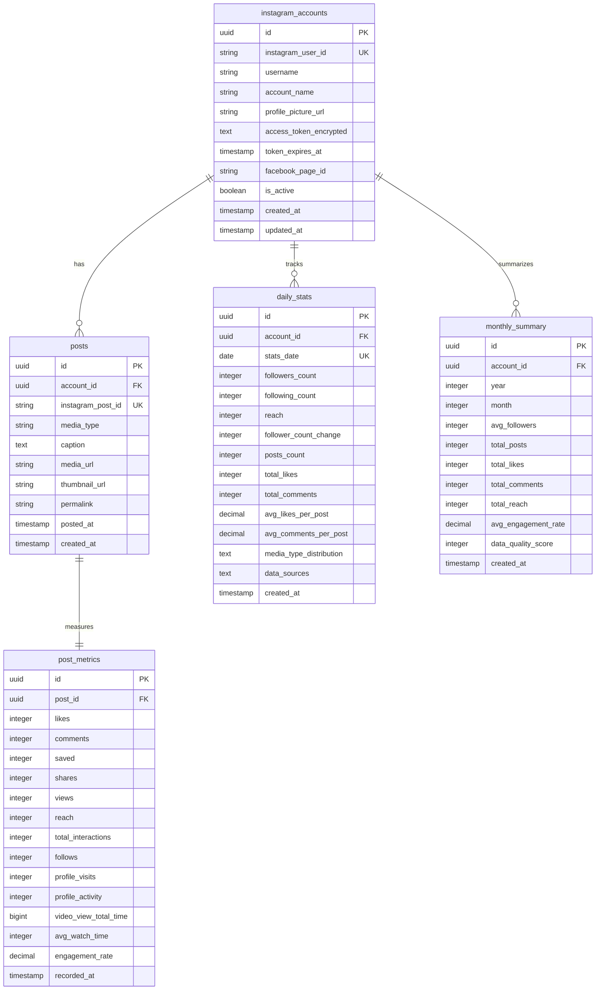
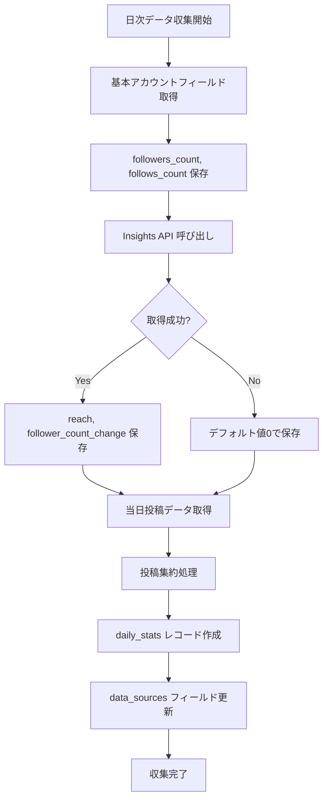

# Instagram Analysis DB Design (実取得可能データ特化版)

**作成日**: 2025-06-25  
**基準**: API検証結果に基づく取得可能データのみ  
**方針**: 実用性重視のシンプル構造  

---

## 設計方針

### 実取得可能データのみに特化
- ✅ **確実に取得可能**: API検証で実際に取得できたデータのみ
- ❌ **取得不可データ削除**: profile_views, website_clicks, new_followers 等
- 🚫 **既存投稿追跡削除**: 過去投稿メトリクス更新機能は除外
- 🎯 **シンプル運用**: 保守しやすい最小構成

---

## ER図



---

## テーブル仕様

### 1. instagram_accounts
```sql
CREATE TABLE instagram_accounts (
    id UUID PRIMARY KEY DEFAULT gen_random_uuid(),
    instagram_user_id VARCHAR(50) UNIQUE NOT NULL,
    username VARCHAR(100) NOT NULL,
    account_name VARCHAR(200),
    profile_picture_url TEXT,
    access_token_encrypted TEXT NOT NULL,
    token_expires_at TIMESTAMP WITH TIME ZONE,
    facebook_page_id VARCHAR(50),
    is_active BOOLEAN DEFAULT true,
    created_at TIMESTAMP WITH TIME ZONE DEFAULT NOW(),
    updated_at TIMESTAMP WITH TIME ZONE DEFAULT NOW()
);
```

### 2. posts  
```sql
CREATE TABLE posts (
    id UUID PRIMARY KEY DEFAULT gen_random_uuid(),
    account_id UUID REFERENCES instagram_accounts(id),
    instagram_post_id VARCHAR(50) UNIQUE NOT NULL,
    media_type VARCHAR(20) NOT NULL,
    caption TEXT,
    media_url TEXT,
    thumbnail_url TEXT,
    permalink TEXT,
    posted_at TIMESTAMP WITH TIME ZONE NOT NULL,
    created_at TIMESTAMP WITH TIME ZONE DEFAULT NOW()
);
```

### 3. post_metrics
```sql
CREATE TABLE post_metrics (
    id UUID PRIMARY KEY DEFAULT gen_random_uuid(),
    post_id UUID REFERENCES posts(id) ON DELETE CASCADE,
    
    -- 全メディア共通（✅取得可能）
    likes INTEGER DEFAULT 0,
    comments INTEGER DEFAULT 0,
    saved INTEGER DEFAULT 0,
    shares INTEGER DEFAULT 0,
    views INTEGER DEFAULT 0,
    reach INTEGER DEFAULT 0,
    total_interactions INTEGER DEFAULT 0,
    
    -- CAROUSEL専用（✅取得可能）
    follows INTEGER DEFAULT 0,
    profile_visits INTEGER DEFAULT 0,
    profile_activity INTEGER DEFAULT 0,
    
    -- VIDEO専用（✅取得可能）
    video_view_total_time BIGINT DEFAULT 0,
    avg_watch_time INTEGER DEFAULT 0,
    
    -- 計算値
    engagement_rate DECIMAL(5,2) DEFAULT 0,
    
    recorded_at TIMESTAMP WITH TIME ZONE DEFAULT NOW(),
    
    UNIQUE(post_id, recorded_at::date)
);
```

### 4. daily_stats（実取得可能データ版）
```sql
CREATE TABLE daily_stats (
    id UUID PRIMARY KEY DEFAULT gen_random_uuid(),
    account_id UUID REFERENCES instagram_accounts(id),
    stats_date DATE NOT NULL,
    
    -- ✅基本フィールドから取得（最安定）
    followers_count INTEGER NOT NULL,
    following_count INTEGER NOT NULL,
    
    -- ✅Insights APIから取得（利用可能な2つのみ）
    reach INTEGER DEFAULT 0,
    follower_count_change INTEGER DEFAULT 0,
    
    -- ✅投稿集約から算出
    posts_count INTEGER DEFAULT 0,
    total_likes INTEGER DEFAULT 0,
    total_comments INTEGER DEFAULT 0,
    avg_likes_per_post DECIMAL(8,2) DEFAULT 0,
    avg_comments_per_post DECIMAL(8,2) DEFAULT 0,
    
    -- メタ情報
    media_type_distribution TEXT DEFAULT '{}',
    data_sources TEXT DEFAULT '[]',
    
    created_at TIMESTAMP WITH TIME ZONE DEFAULT NOW(),
    
    UNIQUE(account_id, stats_date)
);
```

### 5. monthly_summary
```sql
CREATE TABLE monthly_summary (
    id UUID PRIMARY KEY DEFAULT gen_random_uuid(),
    account_id UUID REFERENCES instagram_accounts(id),
    year INTEGER NOT NULL,
    month INTEGER NOT NULL,
    
    -- daily_stats集約
    avg_followers INTEGER DEFAULT 0,
    total_posts INTEGER DEFAULT 0,
    total_likes INTEGER DEFAULT 0,
    total_comments INTEGER DEFAULT 0,
    total_reach INTEGER DEFAULT 0,
    avg_engagement_rate DECIMAL(5,2) DEFAULT 0,
    
    -- データ品質
    data_quality_score INTEGER DEFAULT 0,
    
    created_at TIMESTAMP WITH TIME ZONE DEFAULT NOW(),
    
    UNIQUE(account_id, year, month)
);
```

---

## インデックス設計

```sql
-- アカウント
CREATE INDEX idx_accounts_instagram_user_id ON instagram_accounts(instagram_user_id);
CREATE INDEX idx_accounts_active ON instagram_accounts(is_active) WHERE is_active = true;

-- 投稿
CREATE INDEX idx_posts_account_posted ON posts(account_id, posted_at DESC);
CREATE INDEX idx_posts_media_type ON posts(account_id, media_type);

-- メトリクス
CREATE INDEX idx_metrics_engagement ON post_metrics(engagement_rate DESC);
CREATE INDEX idx_metrics_recorded ON post_metrics(recorded_at DESC);

-- 日別統計
CREATE INDEX idx_daily_account_date ON daily_stats(account_id, stats_date DESC);
CREATE INDEX idx_daily_followers ON daily_stats(followers_count);

-- 月別サマリー
CREATE INDEX idx_monthly_account_period ON monthly_summary(account_id, year DESC, month DESC);
```

---

## データ取得マッピング

### API → DB フィールド対応

| データ種別 | API エンドポイント | API フィールド | DB テーブル.フィールド |
|-----------|------------------|---------------|---------------------|
| **基本情報** | `/{ig-user-id}` | `followers_count` | `daily_stats.followers_count` |
| **基本情報** | `/{ig-user-id}` | `follows_count` | `daily_stats.following_count` |
| **Insights** | `/{ig-user-id}/insights` | `reach` | `daily_stats.reach` |
| **Insights** | `/{ig-user-id}/insights` | `follower_count` | `daily_stats.follower_count_change` |
| **投稿** | `/{ig-user-id}/media` | `like_count` | 集約 → `daily_stats.total_likes` |
| **投稿** | `/{ig-user-id}/media` | `comments_count` | 集約 → `daily_stats.total_comments` |
| **投稿メトリクス** | `/{ig-media-id}/insights` | `likes` | `post_metrics.likes` |
| **投稿メトリクス** | `/{ig-media-id}/insights` | `saved` | `post_metrics.saved` |

---

## データ収集フロー



---

## 削除された要素

### ❌ 取得不可能なフィールド
- `profile_views` - API上存在するがデータなし
- `website_clicks` - API上存在するがデータなし  
- `new_followers` - 利用不可メトリクス
- `impressions` - v22以降廃止

### 🚫 除外した機能
- **既存投稿追跡テーブル**: 過去投稿のメトリクス更新
- **複雑なリレーション**: マルチテナント対応
- **高度な分析テーブル**: トレンド分析、予測など

---

## 運用考慮事項

### データ品質
- **必須データ**: `followers_count`, `following_count` （基本フィールドから確実取得）
- **オプションデータ**: `reach`, `follower_count_change` （エラー時はスキップ）
- **計算データ**: 投稿集約データ（投稿がない日は0）

### API制限対応
- **1日3コール**: 基本フィールド(1) + Insights(1) + 投稿(1)
- **エラー耐性**: 基本フィールド優先、Insights失敗時は継続
- **レート制限**: 200コール/時間 → 66アカウント/日対応可能

### スケーラビリティ  
- **シンプル構造**: 保守・拡張が容易
- **最小インデックス**: パフォーマンス確保
- **JSON フィールド**: 柔軟なメタデータ保存

---

この設計により、**実際に取得可能なデータのみを使用した確実に動作するシステム**を構築できます。